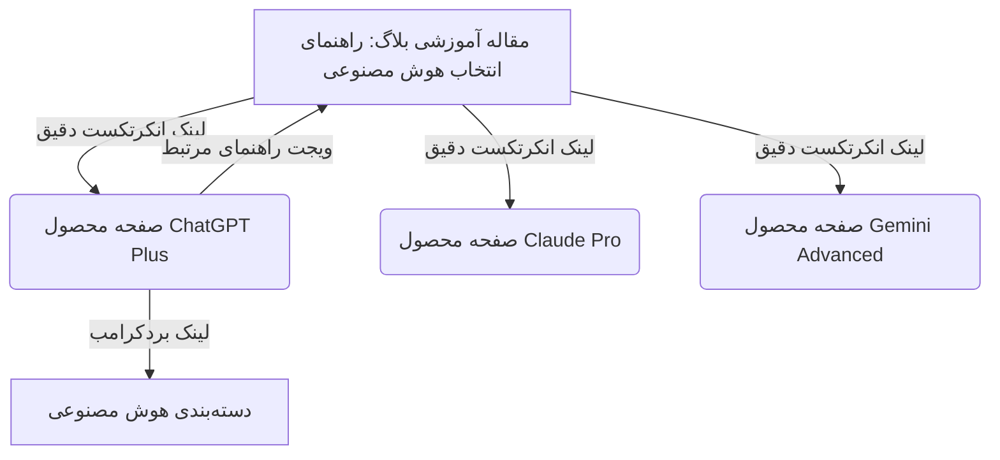

# استراتژی جامع سئو و ماتریس کلمات کلیدی فونیکس وریفای (Phoenix Verify)

این سند مرجع تخصصی سئو (SEO Master Guide) برای دستیابی به رتبه‌های برتر گوگل در جستجوهای مرتبط با خرید اکانت‌های پریمیوم، اشتراک‌های قانونی، ابزارهای هوش مصنوعی و سرویس‌های دیجیتال است.

---

## ۱. نقشه راه کلاسترینگ موضوعی (Topic Clusters) و کلمات کلیدی هدف

| کلاستر موضوعی | صفحه فرود هدف (Landing Page) | کلمات کلیدی اصلی (Primary Keywords) | کلمات کلیدی دم‌دراز با نرخ تبدیل بالا (Long-tail) |
| :--- | :--- | :--- | :--- |
| **هوش مصنوعی (AI)** | `/category/ai` <br> `/products/20-chatgpt` <br> `/products/18-claude-ai` <br> `/products/21-gemini` | خرید اکانت ChatGPT Plus<br>خرید اشتراک ChatGPT 4o / GPT-5<br>خرید اکانت Claude Pro<br>خرید اکانت جمینای ادونسد Gemini<br>خرید اکانت هوش مصنوعی | خرید اکانت چت جی پی تی قانونی بدون شماره مجازی<br>قیمت اکانت Claude sonnet با تحویل فوری<br>خرید اکانت هوش مصنوعی ویدیو ساز Kling<br>تفاوت ChatGPT Plus با نسخه رایگان |
| **استریم و ویدیو** | `/category/streaming` <br> `/products/1-netflix` <br> `/products/11-youtube-premium` | خرید اکانت نتفلیکس Netflix<br>خرید یوتیوب پرمیوم YouTube Premium<br>خرید اشتراک دیزنی پلاس<br>خرید اکانت فیلم و سریال | خرید اکانت نتفلیکس بدون قطعی و با ضمانت<br>خرید اشتراک فمیلی یوتیوب پرمیوم ارزان<br>نحوه فعال‌سازی نتفلیکس روی تلویزیون و موبایل |
| **موسیقی و صدا** | `/category/music` <br> `/products/10-spotify` <br> `/products/5-apple-music` | خرید اکانت اسپاتیفای Spotify<br>خرید اشتراک اپل موزیک Apple Music<br>خرید اکانت موزیک اورجینال | خرید اکانت فمیلی اسپاتیفای با تمدید قانونی<br>انتقال پلی لیست اسپاتیفای به اکانت جدید<br>اشتراک Apple Music بدون نیاز به مسترکارت |
| **طراحی و تدوین** | `/category/graphics` <br> `/products/3-canva-pro` <br> `/products/23-capcut-pro` <br> `/products/25-picsart` | خرید اکانت کانوا پرو Canva Pro<br>خرید اشتراک کپ کات پرو CapCut<br>خرید پیکس آرت گلد PicsArt | خرید اکانت کانوا پرو مادام‌العمر یا یکساله<br>فعال‌سازی کپ کات پرو نسخه ویندوز و اندروید<br>خرید لایسنس ابزارهای هوش مصنوعی گرافیکی |
| **امنیت و فیلترشکن** | `/category/vpn` <br> `/products/38-v2ray` <br> `/products/29-expressvpn` <br> `/products/30-nordvpn` | خرید V2Ray پرسرعت<br>خرید اکانت ExpressVPN<br>خرید اکانت NordVPN<br>خرید VPN اختصاصی و با آی‌پی ثابت | خرید کانفیگ اختصاصی v2ray بدون قطعی همراه اول و ایرانسل<br>خرید فیلترشکن با آی‌پی ثابت برای ترید و صرافی<br>خرید اکانت پروتون وی پی ان اورجینال |
| **آموزشی و زبان** | `/category/education` <br> `/products/12-duolingo` <br> `/products/14-grammarly` <br> `/products/16-elsa-speak` | خرید اکانت دولینگو پلاس Duolingo Super<br>خرید اکانت گرامرلی پرمیوم Grammarly<br>خرید اشتراک السا اسپیک Elsa Speak | خرید اکانت دولینگو فمیلی ارزان<br>خرید اکانت گرامرلی با دسترسی کامل به قابلیت‌های هوش مصنوعی<br>بهترین اپلیکیشن‌های آموزش مکالمه انگلیسی |
| **شبکه‌های اجتماعی** | `/category/social` <br> `/products/15-telegram-premium` <br> `/products/17-discord-nitro` | خرید تلگرام پرمیوم Telegram Premium<br>خرید دیسکورد نیترو Discord Nitro<br>خرید اشتراک توییچ پرایم | خرید تلگرام پرمیوم ۳ ماهه و یکساله بدون لاگین<br>خرید دیسکورد نیترو بوست ارزان و بدون بن شدن<br>فعال‌سازی آنی تلگرام پرمیوم با آیدی |
| **گیفت کارت و کارت اعتباری** | `/category/giftcards` <br> `/products/6-gift-cards` | خرید گیفت کارت اپل Apple Gift Card<br>خرید گیفت کارت استیم Steam<br>خرید گیفت کارت گوگل پلی | خرید گیفت کارت اپل آمریکا با اسکن قانونی<br>شارژ اکانت استیم با بهترین قیمت ریالی<br>خرید مسترکارت مجازی برای پرداخت دلاری |

---

## ۲. اصول تدوین عنوان (Title Tag) و متادیسکریپشن (CTR Optimization)

### الگوی عناوین صفحات محصول:
```text
خرید [نام محصول فارسی] [نام انگلیسی] | [محرک اصلی: قانونی با تحویل آنی / بدون قطعی] | فونیکس وریفای
```
*نمونه:*
- `خرید اکانت ChatGPT Plus قانونی با تحویل آنی | فونیکس وریفای`
- `خرید اکانت نتفلیکس Netflix اورجینال بدون قطعی | فونیکس وریفای`
- `خرید اکانت اسپاتیفای Spotify فمیلی با تمدید امن | فونیکس وریفای`

### الگوی متادیسکریپشن‌ها (۱۳۰ تا ۱۵۵ کاراکتر):
باید شامل ۴ فاکتور اعتماد و اینتنت خرید باشد:
1. **کلمه کلیدی اصلی** (خرید اکانت ...)
2. **مزایای رقابتی** (تحویل فوری، پرداخت امن ریالی، بدون نیاز به شماره مجازی)
3. **ضمانت و پشتیبانی** (ضمانت بازگشت وجه، پشتیبانی ۲۴ ساعته)
4. **شروع قیمت** (از ۱۸۰,۰۰۰ تومان)

*نمونه:*
> خرید اکانت ChatGPT Plus قانونی با دسترسی به GPT-5 و مدل‌های پیشرفته هوش مصنوعی. تحویل آنی، فعال‌سازی اختصاصی، پرداخت ریالی و ضمانت کامل در فونیکس وریفای.

---

## ۳. استراتژی لینک‌سازی داخلی (Internal Linking Formula)

برای جلوگیری از هدررفت اعتبار صفحات (PageRank Leakage) و هدایت خریداران از مقالات آموزشی به صفحات محصول:



### قوانین انکرتکست‌ها (Anchor Text Rules):
- **از انکرتکست‌های عمومی مثل «اینجا کلیک کنید» استفاده نکنید.**
- **از انکرتکست دقیق و نیمه‌دقیق استفاده کنید:**
  - درست: `خرید اکانت ChatGPT Plus` یا `اشتراک قانونی Claude Pro`
  - نادرست: `برای خرید اینجا بزنید`

---

## ۴. تقویم محتوایی پیشنهادی: ۲۰ مقاله وبلاگ با سرچ اینتنت تجاری بالا

این ۲۰ مقاله بر اساس تحلیل رفتار جستجوی کاربران ایرانی، بیشترین ورودی گوگل و بالاترین نرخ تبدیل به فروش را دارند:

1. **مقایسه تخصصی ChatGPT Plus و Claude Pro و Gemini Advanced در ۲۰۲۵** (تارگت کلمات هوش مصنوعی)
2. **راهنمای کامل خرید و فعال‌سازی اکانت ChatGPT بدون شماره خارجی** (تارگت سرچ حل مشکل تحریم)
3. **چرا نباید اکانت کرکی و اشتراکی نامعتبر نتفلیکس بخریم؟ (تفاوت اکانت قانونی و کرک)** (تارگت اعتماد و فروش)
4. **آموزش فعال‌سازی زیرنویس فارسی روی نتفلیکس در تلویزیون و کامپیوتر** (تارگت ورودی ارگانیک استریم)
5. **اسپاتیفای یا اپل موزیک؟ کدام اشتراک موسیقی برای کاربر ایرانی بهتر است؟** (تارگت کلاستر موزیک)
6. **راهنمای انتقال پلی‌لیست‌ها در اسپاتیفای به اکانت جدید بدون از دست رفتن موزیک‌ها** (تارگت حل دغدغه مشتری)
7. **قابلیت‌های مخفی کانوا پرو (Canva Pro) برای تولیدکنندگان محتوا و ادمین‌های اینستاگرام** (تارگت کلاستر طراحی)
8. **آموزش فعال‌سازی ویژگی‌های پریمیوم کپ‌کات (CapCut Pro) در ایران** (تارگت ویرایش ویدیو)
9. **بررسی ارزش خرید تلگرام پرمیوم: آیا تلگرام پرمیوم واقعاً ارزش خرید دارد؟** (تارگت شبکه‌های اجتماعی)
10. **تفاوت دیسکورد نیترو بیسیک (Basic) و نیترو فول (Full) + راهنمای خرید امن** (تارگت گیمینگ)
11. **راهنمای جامع دولینگو پلاس (Duolingo Super): چگونه سریع‌تر زبان یاد بگیریم؟** (تارگت آموزش زبان)
12. **چگونه از گرامرلی پرمیوم برای مقاله‌نویسی و آزمون‌های آیلتس و تافل استفاده کنیم؟** (تارگت دانشجویی و زبان)
13. **بهترین فیلترشکن‌ها و وی‌پی‌ان‌های امن با آی‌پی ثابت برای ترید در صرافی‌ها** (تارگت مالی و VPN)
14. **V2Ray چیست و چرا پایدارترین پروتکل اتصال به اینترنت آزاد است؟** (تارگت V2Ray)
15. **راهنمای جامع خرید و ریدیم (Redeem) کردن گیفت کارت اپل آمریکا** (تارگت گیفت کارت)
16. **نحوه تغییر ریجن اکانت استیم و خرید بازی‌ها با کمترین قیمت** (تارگت گیمرها)
17. **هوش مصنوعی تولید و ادیت ویدیو Kling AI چیست و چگونه از آن استفاده کنیم؟** (تارگت ترند AI)
18. **راهنمای گام‌به‌گام وریفای و احراز هویت در سایت‌های فریلنسری خارجی (Upwork و Fiverr)** (تارگت وریفای)
19. **معرفی بهترین ابزارهای هوش مصنوعی برای کدنویسی و برنامه‌نویسی در سال ۲۰۲۵** (تارگت دولوپرها)
20. **نکات کلیدی امنیت پرداخت در خریدهای دیجیتال و کارت به کارت امن** (تارگت اعتماد و پرداخت)

---

## ۵. چک‌لیست سئوی تکنیکال و نگهداری دوره‌ای (Technical Checklist)

- [x] **اسکیمای Organization:** نام، لوگو، متدهای پرداخت و راه‌های ارتباطی در تمام صفحات
- [x] **اسکیمای WebSite با SearchAction:** امکان سرچ مستقیم محصولات در گوگل
- [x] **اسکیمای Product و AggregateOffer:** قیمت به ریال/تومان، وضعیت موجودی و گارانتی
- [x] **اسکیمای BreadcrumbList:** در تمام صفحات محصولات، بلاگ و دسته‌بندی‌ها
- [x] **اسکیمای FAQPage:** در صفحه اصلی و تمام صفحات محصول دارای سوالات متداول
- [x] **اسکیمای BlogPosting:** در تک‌تک مقالات وبلاگ همراه با Author و Publisher
- [x] **فایل Sitemap داینامیک:** در `/sitemap.xml` با اولویت‌بندی هوشمند و تاریخ انتشار
- [x] **فایل Robots استاندارد:** در `/robots.txt` برای جلوگیری از خزش بخش‌های ادمین و حساب کاربری
- [ ] **بررسی ماهیانه گوگل سرچ کنسول (Google Search Console):** بررسی خطاهای Coverage، Core Web Vitals و کلیک‌ها.
